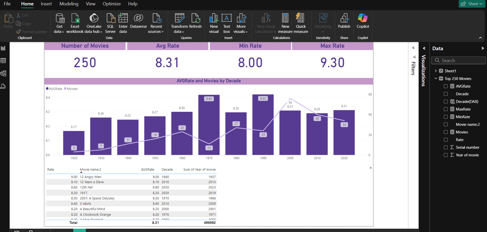

# IMDb Top 250 Movies Analysis

## Overview
This project analyzes the top 250 movies from IMDb using Power BI. The goal is to showcase data analysis and visualization skills by working with real-world datasets.

## Features
- **Data Source:** IMDb's top 250 movies.
- **Measures:**
  - Maximum, Minimum, and Average ratings.
  - Number of movies per decade.
- **Visualizations:**
  - Cards for key metrics.
  - A bar chart showing the number of movies per decade.
  - A table that displays detailed movie information based on the selected decade.

## Tools Used
- **Power BI**
- **DAX** (Basic formulas for measures)
- **Data Transformation:** Cleaned and prepared the dataset within Power BI.

## Insights
- Which decade has the most movies?
- Average and highest-rated movies across all decades.

## Screenshots

## How to Use
1. Clone this repository.
2. Open the `.pbix` file in Power BI.
3. Explore the dashboard and interact with the visuals.

## Future Improvements
- Adding more detailed analysis like genre distribution.
- Expanding the dataset to include other metrics.

